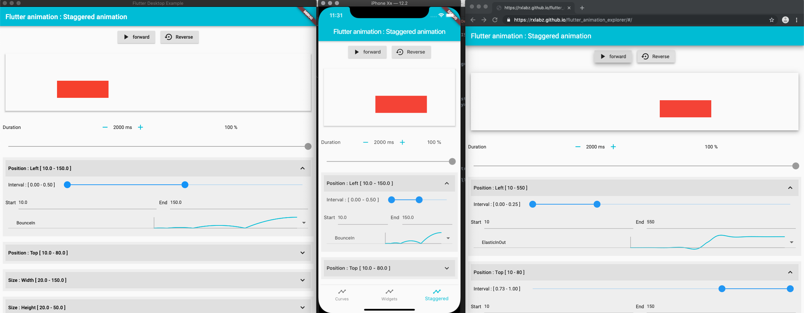

# Flutter animation interactive guide

## [Try it online](https://t.co/sVq1mL3jg9?amp=1)




- Curves visualizer
- Animated widgets demo : 
  - AnimatedContainer
  - AnimatedAlign
  - AnimatedPositioned
  - AnimatedOpacity
  - AnimatedDefaultTextStyle
 - Staggered animation explorer
    
## web

You need to be on Flutter master branch to run/build for web, and [follow this instructions](https://github.com/flutter/flutter/wiki/Building-a-web-application-with-Flutter)

```bash
flutter run -d chrome
```

## mac os

You need to be on Flutter master branch to run/build for web, and [follow this instructions](https://github.com/flutter/flutter/wiki/Desktop-shells)

```bash
flutter run -d macos -t lib/main_desktop.dart
```


